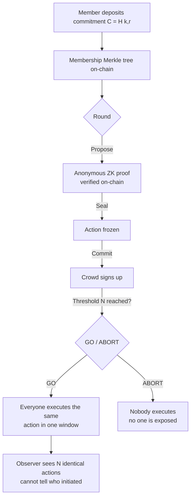

# mirror-pool

**A synchronized behavioral mixer for Solana — a crowd-sourced anonymity set for
*behavior*, not funds.**

On a public ledger every action is legible and increasingly fed into AI-powered
analytics that cluster wallets and front-run intent. mirror-pool makes *behavior*
collectively deniable: many independent wallets perform the **same standardized
action inside the same synchronized time window**, so an observer can see *that*
an action happened but not *which participant genuinely wanted it* nor *who
summoned the crowd*.

It ports the Tornado Cash architecture — commitments, a Merkle membership set,
nullifiers, and relayers — from *hiding which deposit is withdrawn* to *hiding
who originated a behavioral pattern*. Non-custodial, in Rust, with zero-knowledge
proofs **verified on-chain**.

> ⚠️ **Experimental.** Ships with development trusted-setup keys. Not for
> production until the release gates in [`docs/ROADMAP.md`](docs/ROADMAP.md) §5
> are met (a trusted-setup ceremony, an audit, and keeper decentralization).

---

## The idea in one picture

Two independent anonymities compose (see [`docs/DESIGN.md`](docs/DESIGN.md) §3):

- **Initiator anonymity** — who *summoned* the round's action is hidden by a
  zero-knowledge membership proof.
- **Intent anonymity** — which of the many wallets *genuinely wanted* the action
  is hidden by the uniform, synchronized crowd (free).



The initiator's proof reveals only a per-round nullifier `H(k, round_id)` — never
*which* member proposed. The crowd's uniform execution buries any single
participant's genuine intent.

---

## What's implemented

| Component | Status | Tests |
|---|---|---|
| **`mp-crypto`** — Poseidon, incremental Merkle tree, notes & nullifiers | ✅ | 18 |
| **`programs/mirror_pool`** — membership tree, deposit, round state machine, nullifier set, **on-chain Groth16 verification**, cover credits | ✅ | 16 |
| **`mp-proof`** — `S_propose` R1CS circuit, Groth16 proving, groth16-solana byte conversion | ✅ | 8 |
| **`mp-agent`** — keystore, action policy, anonymous proposal builder + CLI | ✅ | 10 |
| **`mp-relayer`** — trust-minimized propose transaction builder | ✅ | 4 |
| **`mp-eval`** — adversarial evaluation (does it defeat chain-analysis?) | ✅ | 2 |
| **`mp-keeper`** — crowd synchronization | 🚧 scaffold | — |
| Monetary cover market, trusted-setup ceremony, keeper decentralization | 📋 planned | — |

**58 tests**, CI-green (`fmt` + `clippy` + `test`). The anonymous-proposal loop
works **end to end**: deposit → off-chain proof → **on-chain verification**.

### Does it actually defeat chain-analysis?

We measure it. The **same** timing deanonymizer (name the earliest executor as
the initiator) is run against copy-trading and against mirror-pool
([`docs/ADVERSARIAL.md`](docs/ADVERSARIAL.md), `cargo run -p mp-eval`):

| Behavior | Initiator-attribution accuracy |
|---|---:|
| Naive copy-trading | **1.0000** |
| **mirror-pool** | **0.0198** (≈ `1/N`, i.e. random) |

The heuristic that names the initiator every time under copy-trading collapses to
random guessing under mirror-pool — a property guarded by a CI test.

Highlights of the cryptographic core, each validated by a cross-check test:

- the **on-chain** Poseidon (Solana syscall) reproduces the **off-chain** hash
  (`light-poseidon`) byte-for-byte;
- the **in-circuit** Poseidon gadget matches both (it reuses `light-poseidon`'s
  exact constants);
- the arkworks→`groth16-solana` proof/VK byte format is verified against
  `groth16-solana`'s own verifier.

---

## Repository layout

```
crates/
  mp-crypto     Poseidon, incremental Merkle tree, notes & nullifiers   (pure Rust)
  mp-proof      S_propose circuit, Groth16 proving, on-chain byte format (arkworks)
  mp-agent      participant agent: keystore, policy, proposal builder + CLI
  mp-relayer    trust-minimized propose transaction builder
  mp-eval       adversarial evaluation harness (timing attribution)
  mp-keeper     trust-minimized execution synchronizer     (scaffold)
programs/
  mirror_pool   on-chain Anchor program (Groth16-verified propose)
docs/
  DESIGN.md       architecture / whitepaper
  ROADMAP.md      phased implementation plan
  ADVERSARIAL.md  adversarial evaluation results
```

---

## Build & test

**Prerequisites:** Rust (stable), and for the on-chain program the Solana CLI
(Agave 3.1.x) and Anchor 1.1.2.

The pure-Rust crates need only Rust:

```bash
cargo test -p mp-crypto -p mp-proof -p mp-agent
```

The on-chain program is built with Anchor, then tested against LiteSVM:

```bash
anchor build                          # produces target/deploy/mirror_pool.so
cargo test -p mirror-pool-program     # cross-check, round lifecycle, on-chain verify
```

`cargo test --workspace` runs everything; the program tests skip gracefully if
the `.so` has not been built.

Regenerate the development verifying key (after any circuit change):

```bash
cargo run -p mp-proof --example gen_vk > programs/mirror_pool/src/vk.rs
cargo fmt --all
```

---

## Try the agent CLI

```bash
# Generate a membership note (the only secret a member keeps).
cargo run -p mp-agent -- keygen --out note.json

# Print the pool commitment (the deposit leaf) for a keystore.
cargo run -p mp-agent -- commitment --keystore note.json

# Print the default action policy (stake/unstake at 1 / 10 / 100 SOL).
cargo run -p mp-agent -- policy
```

The agent's `build_proposal` (library) turns a note + a tree snapshot into the
exact arguments the on-chain `propose` instruction verifies.

---

## Security & non-goals

- **Non-custodial.** The program never holds operating funds; participants act on
  their own wallets against real protocols. mirror-pool coordinates *timing and
  uniformity*, never money.
- **Not a fund mixer.** It hides the *behavioral pattern*, not the funds
  themselves — that is a different tool (see `docs/DESIGN.md` §1.4).
- **Development keys.** The embedded verifying key comes from a single-party
  setup. A multi-party ceremony, an audit, and keeper decentralization are
  tracked as release gates (`docs/ROADMAP.md` §5).

See [`docs/DESIGN.md`](docs/DESIGN.md) for the threat model, anonymity analysis,
and open research problems, and [`docs/ROADMAP.md`](docs/ROADMAP.md) for the
phased plan.

## License

MIT — see [LICENSE](LICENSE).
