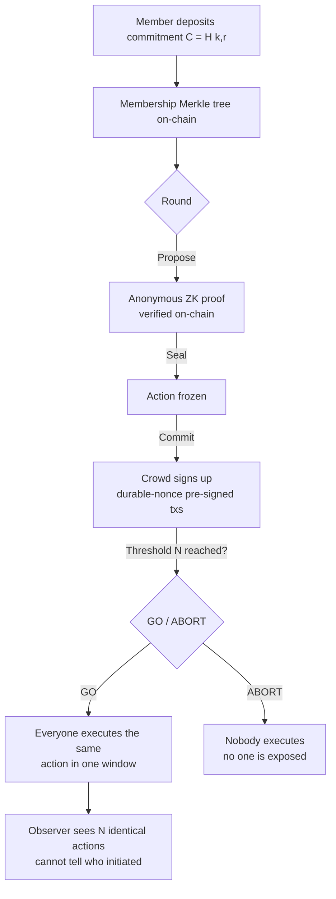

# mirror-pool

**A synchronized behavioral mixer for Solana — a crowd-sourced anonymity set for
*behavior*, not funds.**


On a public ledger every action is legible, and the graph it forms is
increasingly read by AI-powered analytics that cluster wallets, attribute
identities, and front-run intent in real time. Most privacy tools hide *funds*.
mirror-pool hides *behavior*: many independent wallets perform the **same
standardized action inside the same synchronized time window**, so an observer
sees *that* an action happened — and even which wallets performed it — but cannot
tell **which participant genuinely wanted it**, nor **who caused the crowd to
assemble**.

It ports the Tornado Cash architecture — commitments, a Merkle membership set,
nullifiers, and relayers — from *hiding which deposit is withdrawn* to *hiding
who originated a behavioral pattern*. Non-custodial, written entirely in Rust,
with the zero-knowledge proof **verified on-chain** through Solana's
`alt_bn128` syscalls.

> 📄 **Read the whitepaper:** [`docs/mirror-pool.pdf`](docs/mirror-pool.pdf).

> ⚠️ **Experimental.** Ships with development trusted-setup keys. Not for
> production until the release gates in [`docs/ROADMAP.md`](docs/ROADMAP.md) §5
> are met (a trusted-setup ceremony, an audit, and keeper decentralization).

---

## The idea

Two independent anonymities compose (see [`docs/DESIGN.md`](docs/DESIGN.md) §3):

- **Initiator anonymity** — who *summoned* the round's action is hidden by a
  zero-knowledge membership proof, submitted through a relayer so no wallet even
  pays for the proposal.
- **Intent anonymity** — which of the many executing wallets *genuinely wanted*
  the action is hidden by the uniform, synchronized crowd. This one is free.


```mermaid
flowchart TD
    A[Member deposits commitment C = H k,r] --> B[Membership Merkle tree on-chain]
    B --> C{Round}
    C -->|Propose| D[Anonymous ZK proof<br/>verified on-chain]
    D -->|Seal| E[Action frozen]
    E -->|Commit| F[Crowd signs up<br/>durable-nonce pre-signed txs]
    F -->|Threshold N reached?| G{GO / ABORT}
    G -->|GO| H[Everyone executes the same<br/>action in one window]
    G -->|ABORT| I[Nobody executes<br/>no one is exposed]
    H --> J[Observer sees N identical actions<br/>cannot tell who initiated]
```

The initiator's proof reveals only a per-round nullifier `H(k, round_id)` — never
*which* member proposed. The crowd's uniform execution buries any single
participant's genuine intent. Nothing is custodial: every action runs on the
participant's own wallet against the real protocol.

---

## Does it actually defeat chain-analysis?

We measure it, rather than assert it. The **same** timing deanonymizer is run
against copy-trading and against mirror-pool
([`docs/ADVERSARIAL.md`](docs/ADVERSARIAL.md), `cargo run -p mp-eval`). With a
crowd of `N = 50`, random guessing scores `1/N = 0.02`:

| Adversary | Copy-trading | mirror-pool |
|---|---:|---:|
| Earliest-executor (per round) | **1.0000** | **0.0198** |
| Most-frequently-earliest (cross-round, power initiator) | **0.5116** | **0.0138** |

Two reasonable attacks — one per-round, one longitudinal — both identify the
initiator under copy-trading and both collapse to random guessing under
mirror-pool. The ordering signal they rely on is erased by the synchronized
jitter. Both properties are guarded by CI tests that fail if attribution ever
climbs back up.

---

## What's implemented

| Component | Status | Tests |
|---|:---:|:---:|
| **`mp-crypto`** — Poseidon (circomlib-KAT verified), incremental Merkle tree, notes & nullifiers | ✅ | 19 |
| **`programs/mirror_pool`** — membership tree, deposit, round state machine, nullifier set, **on-chain Groth16 verification**, cover credits | ✅ | 20 |
| **`mp-proof`** — `S_propose` R1CS circuit, Groth16 proving, `groth16-solana` byte conversion | ✅ | 8 |
| **`mp-agent`** — keystore, action policy, anonymous proposal builder + CLI | ✅ | 10 |
| **`mp-relayer`** — trust-minimized propose transaction builder | ✅ | 4 |
| **`mp-keeper`** — durable-nonce pre-signing + batched execution | ✅ | 3 |
| **`mp-eval`** — adversarial evaluation harness | ✅ | 3 |
| Monetary cover market, trusted-setup ceremony, keeper decentralization, live RPC | 📋 planned | — |

**67 tests**, CI-green (`fmt` + `clippy` + `test`, plus an on-chain job that
builds the program and runs the LiteSVM suite). The anonymous-proposal loop works
**end to end**: deposit → off-chain proof → **on-chain verification**.

Three properties in the cryptographic core are each pinned by a cross-check:
the **on-chain** Poseidon (Solana syscall) reproduces the **off-chain** hash
(`light-poseidon`) byte-for-byte; the **in-circuit** Poseidon gadget matches both
and is anchored to circomlib by a known-answer test; and the arkworks →
`groth16-solana` proof/VK byte format is verified against `groth16-solana`'s own
verifier before it ever reaches the chain.

---

## Repository layout

```
crates/
  mp-crypto     Poseidon, incremental Merkle tree, notes & nullifiers   (pure Rust)
  mp-proof      S_propose circuit, Groth16 proving, on-chain byte format (arkworks)
  mp-agent      participant agent: keystore, policy, proposal builder + CLI
  mp-relayer    trust-minimized propose transaction builder
  mp-keeper     durable-nonce pre-signing + batched execution
  mp-eval       adversarial evaluation harness (timing attribution)
programs/
  mirror_pool   on-chain Anchor program (Groth16-verified propose)
docs/
  mirror-pool.pdf   the whitepaper
  DESIGN.md         architecture / detailed spec
  ROADMAP.md        phased implementation plan
  ADVERSARIAL.md    adversarial evaluation results
```

---

## Build & test

**Prerequisites:** Rust (stable). For the on-chain program, the Solana CLI
(Agave 3.1.x) and Anchor 1.1.2.

The pure-Rust crates need only Rust:

```bash
cargo test -p mp-crypto -p mp-proof -p mp-agent -p mp-relayer -p mp-keeper -p mp-eval
```

The on-chain program is built with Anchor, then tested against LiteSVM:

```bash
anchor build                          # produces target/deploy/mirror_pool.so
cargo test -p mirror-pool-program     # cross-check, round lifecycle, on-chain verify, ...
```

`cargo test --workspace` runs everything; the program tests skip gracefully if
the `.so` has not been built.

Regenerate the development verifying key (after any circuit change):

```bash
cargo run -p mp-proof --example gen_vk > programs/mirror_pool/src/vk.rs
cargo fmt --all
```

---

## Try the agent CLI

```bash
# Generate a membership note (the only secret a member keeps).
cargo run -p mp-agent -- keygen --out note.json

# Print the pool commitment (the deposit leaf) for a keystore.
cargo run -p mp-agent -- commitment --keystore note.json

# Print the default action policy (stake/unstake at 1 / 10 / 100 SOL).
cargo run -p mp-agent -- policy
```

The agent's `build_proposal` (library) turns a note plus a tree snapshot into the
exact arguments the on-chain `propose` instruction verifies.

---

## Documentation

| Document | What it covers |
|---|---|
| [**Whitepaper**](docs/mirror-pool.pdf) | the solution, end to end, in paper form |
| [DESIGN.md](docs/DESIGN.md) | detailed spec: threat model, the two anonymities, round lifecycle, circuit, incentives, security analysis |
| [ROADMAP.md](docs/ROADMAP.md) | phased implementation plan and release gates |
| [ADVERSARIAL.md](docs/ADVERSARIAL.md) | the chain-analysis evaluation and its method |

---

## Security & non-goals

- **Non-custodial.** The program never holds operating funds; participants act on
  their own wallets against real protocols. mirror-pool coordinates *timing and
  uniformity*, never money.
- **Not a fund mixer.** It hides the *behavioral pattern*, not the funds
  themselves — a different tool's job (see `docs/DESIGN.md` §1.4).
- **Membership is public**, exactly as in Tornado Cash: what is hidden is the
  link between membership and *origination*, not the fact of joining.
- **Development keys.** The embedded verifying key comes from a single-party
  setup. A multi-party ceremony, an audit, and keeper decentralization are
  tracked as release gates (`docs/ROADMAP.md` §5).

## License

MIT — see [LICENSE](LICENSE).
